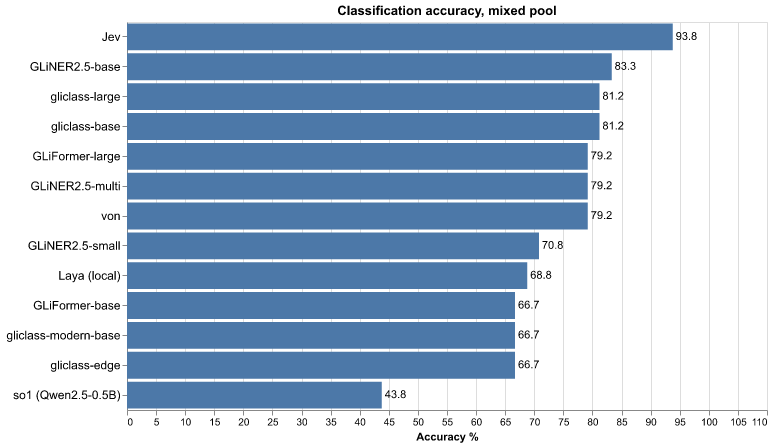
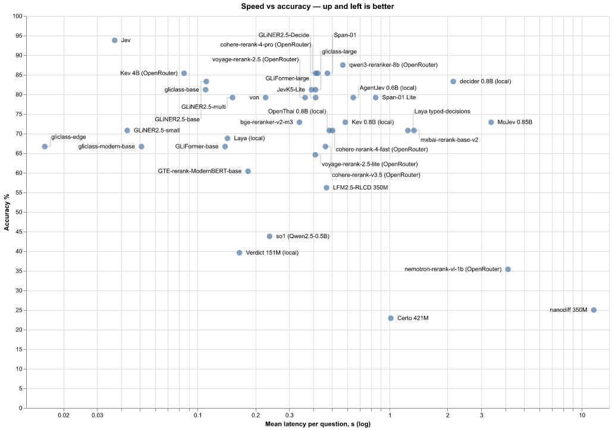
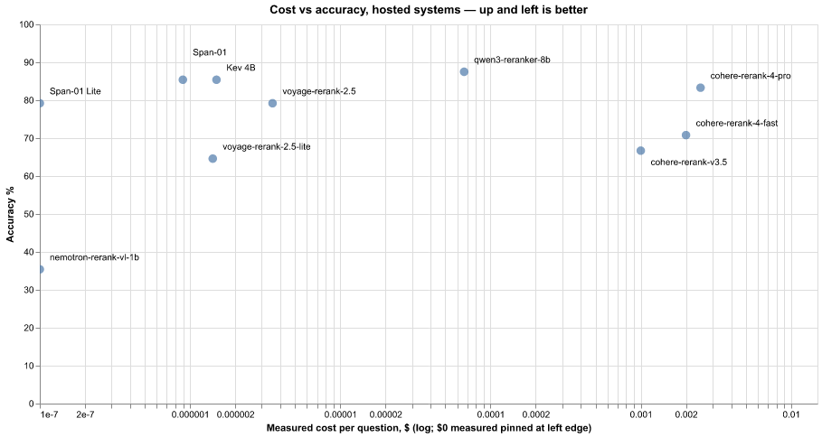
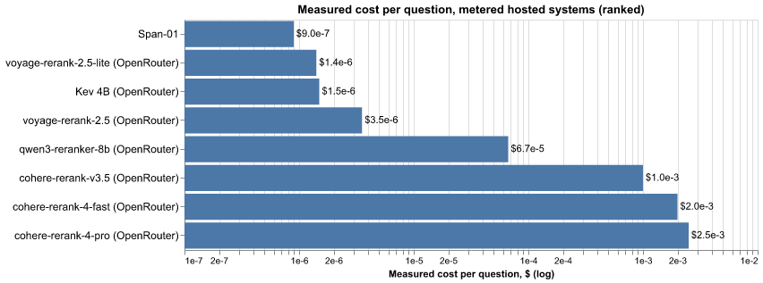
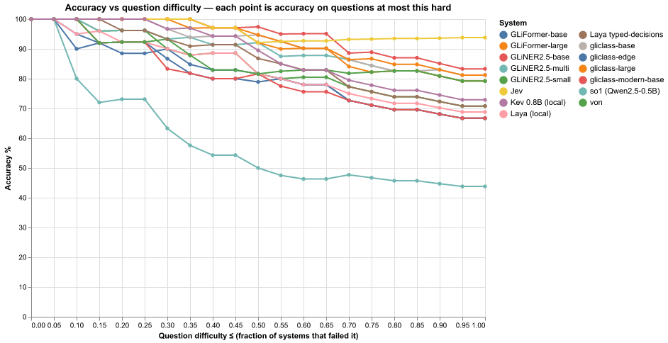
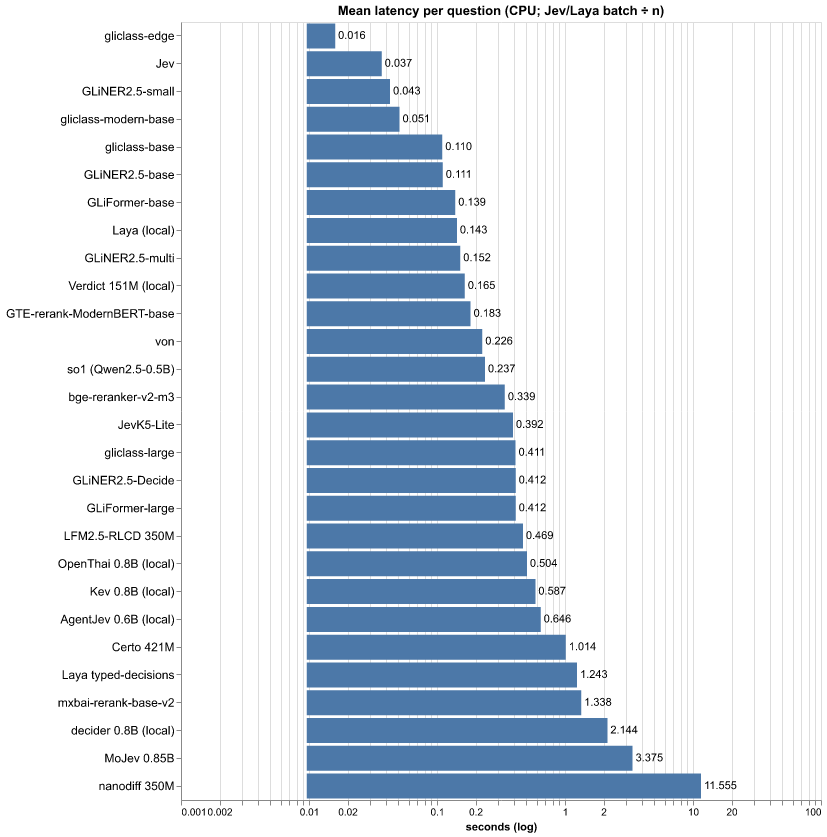
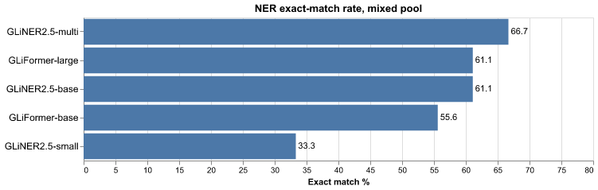
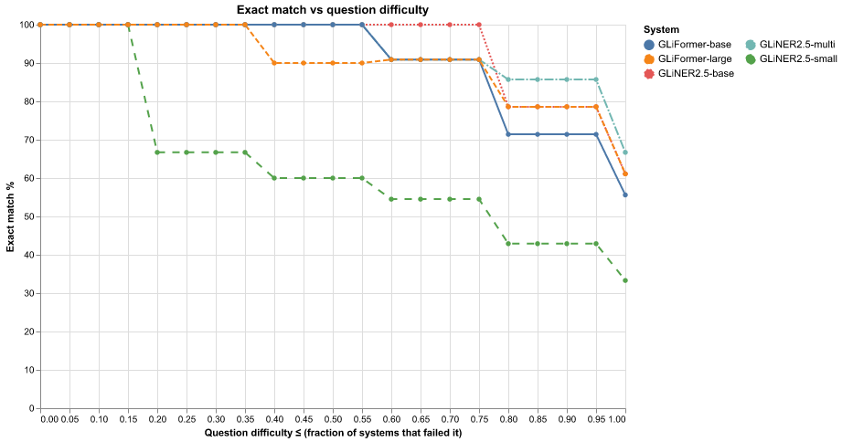
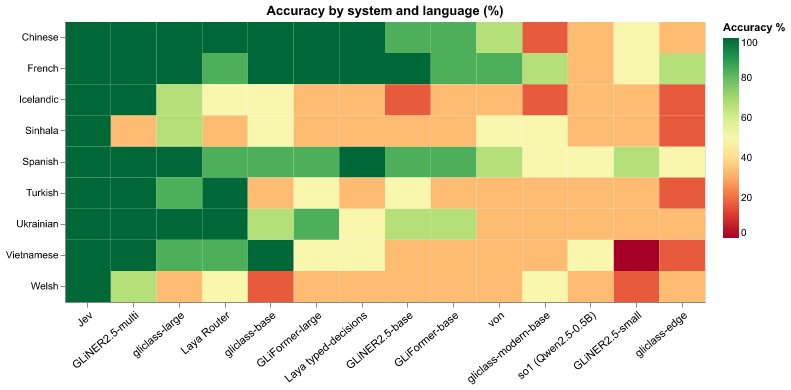
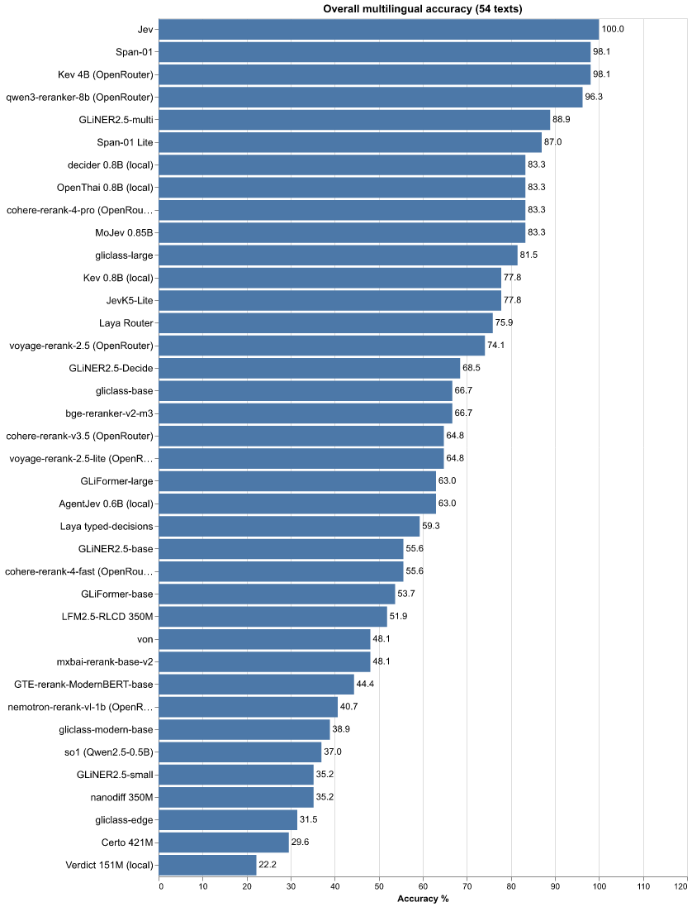

# zero-shot-ie-bench

Thirty-eight zero-shot systems across twenty-three information-extraction
and classification families — extractor encoders, a purpose-built
classifier, cross-encoder rerankers, and typed-decision engines (local and
cloud, the hosted ones behind OpenRouter's decision and rerank endpoints)
— demoed, benchmarked, and cross-compared in one repo with a web UI.

| System | Kind | Size | License | Cost |
|---|---|---|---|
| [GLiNER 2.5](https://github.com/fastino-ai/GLiNER2) (`fastino/gliner2.5-*`) | local extractor encoder (boundary arch) | 74M / 194M / 287M | Apache 2.0 | $0 · local |
| [GLiNER2.5-Decide](https://huggingface.co/fastino/GLiNER2.5-Decide) (`fastino/GLiNER2.5-Decide`) | local decision-tuned classifier in the GLiNER 2.5 family (spans + label heads, one pass) | 340M | Apache 2.0 | $0 · local |
| [GLiFormer](https://github.com/Knowledgator/GLiFormer) (`knowledgator/gliformer-*`) | local extractor encoder (layout-aware DeBERTa) | ~190M / 575.6M | Apache 2.0 | $0 · local |
| [GLiClass](https://github.com/knowledgator/gliclass) (`knowledgator/gliclass-*-v3.0`) | local zero-shot classifier (all labels, one pass) | 33M / 151M / 187M / 439M | Apache 2.0 | $0 · local |
| [mxbai-rerank-base-v2](https://huggingface.co/mixedbread-ai/mxbai-rerank-base-v2) · [bge-reranker-v2-m3](https://huggingface.co/BAAI/bge-reranker-v2-m3) · [GTE-rerank-ModernBERT-base](https://huggingface.co/Alibaba-NLP/gte-reranker-modernbert-base) | local cross-encoder rerankers (score text+label pairs, argmax = decision) | 494M / 568M / 150M | Apache 2.0 | $0 · local |
| [Laya](https://huggingface.co/convaiinnovations/laya) (`laya`) | local typed-decision engine (choice/score/noul) | 421M (322M multilingual) | Apache 2.0 | $0 · local |
| [von-1.0](https://huggingface.co/wfzyx/von-1.0) (`von-sdk`) | local typed-decision engine (System One protocol) | 396M | Apache 2.0 | $0 · local |
| [open-alternative-jev](https://github.com/ikermoel/open-alternative-jev) (`so1`) | local decision harness over any ChatML LLM (logprobs) | BYO LLM (tested Qwen2.5-0.5B) | MIT | $0 · local |
| [Kev](https://github.com/jaredpalmer/kev) (`jaredpalmer/kev-0.8b`) | local decision engine (open-weight Jev lookalike, System One contract) | 0.8B (9.3M trained) | Apache 2.0 | $0 · local |
| [AgentJev](https://github.com/malevrigns/agent-jev) | local decision engine (candidate head over Qwen3-0.6B, own API) | 0.6B | Apache 2.0 | $0 · local |
| [decider](https://huggingface.co/Mapika/decider-0.8b) (`decider-ai`) | local decision engine (System One contract) | 0.8B | Apache 2.0 | $0 · local |
| [OpenThai-SystemOne](https://huggingface.co/iapp-technology/OpenThai-SystemOne) (`openthai-systemone`) | local decision engine (Thai/English, System One contract) | 0.8B | Apache 2.0 package; weights gated on HF | $0 · local |
| [Verdict](https://huggingface.co/heman10x/rlcd-modernbert-151m) | local decision encoder (ModernBERT + abstention head) | 151M | Apache 2.0 | $0 · local |
| [JevK5-Lite](https://huggingface.co/alibiserikbay/JevK5-Lite) (`jevk5` runtime) | local decision classifier (label-head encoder, one pass) | 437M | Apache 2.0 | $0 · local |
| [LFM2.5-RLCD](https://huggingface.co/notnotsamuel/LFM2.5-350M-RLCD) (`engines/rlcd_engine/`, vendored) | local decision engine (constrained decoding over LFM2.5) | 350M | engine MIT; weights LFM Open License v1.0 | $0 · local |
| [Certo 421M](https://huggingface.co/altslate/certo-decision-model) (`engines/certo_engine/`, vendored) | local decision model (calibrated per-option score head over ModernBERT-large, no generation) | 421M | MIT (engine + weights) | $0 · local |
| [MoJev](https://huggingface.co/MoLeMo-Lab/mojev) 0.85B (`engines/mojev_engine/`, adapted) | local decision engine (packed one-pass candidate scoring, Qwen3.5 + fla) | 0.85B | engine MIT; checkpoint card MIT (Qwen base-model license on the encoder weights) | $0 · local |
| [nanodiff 350M](https://huggingface.co/pngwn/nanodiff-350m-typed-decisions-lam1) (`engines/nanodiff_engine/`, vendored) | local decision model (bidirectional diffusion LM — the only non-autoregressive system here) | 350M | MIT | $0 · local |
| [Jev](https://www.typesafe.ai/) (`jev-latest` via System One API) | cloud typed-decision engine (choice/score/noul) | closed | proprietary API | metered · n/r ‡ |
| [Kev 4B](https://openrouter.ai/jaredpalmer/kev-4b) (`jaredpalmer/kev-4b` via OpenRouter) | cloud decision engine (same System One contract as local Kev, hosted) | 4B | proprietary API | metered · $1.5e-6/q † |
| [Span-01](https://openrouter.ai/respan/span-01) / [Span-01 Lite](https://openrouter.ai/respan/span-01-lite) (`respan/span-01*`) | cloud behavior scorer (one noul probability per label, argmax = decision) | closed | proprietary API | metered · $9.0e-7/q · Lite free † |
| [Qwen3-Reranker 8B](https://openrouter.ai/qwen/qwen3-reranker-8b) · [Voyage rerank-2.5](https://openrouter.ai/voyageai/rerank-2.5) (+lite) · [Nemotron Rerank VL 1B](https://openrouter.ai/nvidia/llama-nemotron-rerank-vl-1b-v2:free) · [Cohere Rerank](https://openrouter.ai/cohere/rerank-4-pro) (4 Pro / 4 Fast / v3.5), all via OpenRouter | cloud rerankers (same (instruction, label) argmax mapping as the local ones) | 8B / closed / 1.7B / closed | proprietary API | metered · $1.4e-6–$2.5e-3/q · Nemotron free † |

† Non-ZDR endpoints: these providers may retain request data (OpenRouter's
account privacy settings gate this — the account used here allows them).
Every local system in the repo keeps text on the machine. The Cost column
marks who bills per request: `$0 · local` systems cost no API money
(only CPU time), `metered` systems bill per token/search with the
**measured** $ per mixed-pool question shown (see [Measured cost per
hosted run](#measured-cost-per-hosted-run)); ‡ Jev's provider reports
tokens but no cost, so it has no measured $ figure.

The GLiNER lineage forked: Urchade Zaratiana (original GLiNER author,
ex-Knowledgator) is on the GLiNER2 paper with Fastino; Knowledgator kept the
classic `gliner` package, built GLiFormer on it and also maintains GLiClass.
Laya's card positions it explicitly as the open local counterpart of cloud
Jev; von speaks the same System One protocol locally, and so1 is a library
that turns any open LLM into a Jev-style decider. The open "Jev
alternative" wave added seven more local engines, all benchmarked here:
Kev and AgentJev (open-weight Jev lookalikes), decider and
OpenThai-SystemOne (further System One contract servers), Verdict (a
151M ModernBERT decision head with trained abstention), JevK5-Lite (the
CPU-sized lite build of JevBench's #3 JevK5) and LFM2.5-RLCD (an
RLCD-trained LFM2.5 driven by a constrained-decoding engine). The newest
cut widens the mechanism space: three cross-encoder rerankers pressed
into service as decision engines (score text+label pairs, take the
argmax), Certo (a calibrated per-option score head over ModernBERT-large),
MoJev (packed one-pass candidate scoring over a Qwen3.5 + fla encoder)
and nanodiff (a bidirectional diffusion LM — the only non-autoregressive
system here). Four different animals:

- **Extractors** (GLiNER 2.5, GLiFormer): spans, entities, relations,
  records — per-text calls, run offline.
- **Classifiers** (GLiClass): zero-shot text→label scores with every label
  answered in one forward pass.
- **Cross-encoder rerankers** (mxbai-rerank-base-v2, bge-reranker-v2-m3,
  GTE-rerank-ModernBERT-base locally; Qwen3, Voyage 2.5, NVIDIA Nemotron VL
  and Cohere Rerank via OpenRouter †): relevance scores for (instruction,
  label) pairs — one pair per label, argmax = decision. No NER, no
  generation; a zero-shot classifier built out of a reranker.
- **Decision engines** (Laya, von, so1, Kev, AgentJev, decider, OpenThai,
  Verdict, JevK5-Lite, LFM2.5-RLCD, Certo, MoJev, nanodiff, Jev; hosted:
  Kev 4B and the Span-01 behavior scorer via OpenRouter †): you ask
  typed questions (`choice`, `score`, `noul`) over a JSON state; all
  questions in one call are answered together (one forward pass / one
  request). This benchmark exercises Verdict's `choice` questions only;
  its API also defines `score` rubrics and `noul`.

## Benchmark results

Measured on CPU, zero-shot, identical label sets and descriptions,
out-of-the-box defaults. Full detail and per-item misses in
[`results/bench_results.json`](results/bench_results.json); methodology notes in `bench.py`.

Every case runs 5 times; accuracy below is from the first run, and the
determinism section shows whether repeats changed anything (spoiler: no).

Classification accuracy (mean latency ± std per text):

| System | Sentiment (24) | Topic (12) | s/text (sentiment+topic mean) |
|---|---|---|---|
| GLiNER2.5-small | 83.3% | 100% | 0.053±0.019 |
| GLiNER2.5-base | 100% | 100% | 0.105±0.007 |
| GLiNER2.5-multi | 100% | 100% | 0.126±0.014 |
| GLiFormer-base | 100% | 75.0% | 0.118±0.013 |
| GLiFormer-large | 100% | 83.3% | 0.399±0.035 |
| Laya (local) | 95.8% | 83.3% | 0.164±0.009 (batched ÷ n) |
| Jev (cloud) | 100% | 100% | 0.052±0.002 (batched ÷ n) |

NER, strict document+span+label match over 30 gold entities (decision
engines have no span output; refreshed after correcting document identity):

| System | Precision | Recall | F1 | s/text |
|---|---|---|---|---|
| GLiNER2.5-small | 0.78 | 0.97 | 0.87 | 0.051±0.015 |
| GLiNER2.5-base | 0.94 | 1.00 | 0.97 | 0.111±0.007 |
| GLiNER2.5-multi | 0.97 | 1.00 | 0.98 | 0.127±0.037 |
| GLiFormer-base | 1.00 | 1.00 | **1.00** | 0.129±0.023 |
| GLiFormer-large | 0.97 | 1.00 | 0.98 | 0.447±0.066 |

### Determinism (5 runs per case)

Output stability — share of cases whose prediction was identical across all
5 runs (label for classification, full span set for NER):

| System | Sentiment | Topic | NER span sets |
|---|---|---|---|
| GLiNER2.5 small/base/multi | 100% | 100% | 100% |
| GLiFormer base/large | 100% | 100% | 100% |
| Laya (local) | 100% | 100% | n/a |
| Jev (cloud) | 100% | 100% | n/a |

**Every system was fully deterministic** — identical predictions on every
repeat, including the cloud API. The only measured variance is latency
(σ ≈ 0.002–0.07 s; largest for GLiFormer-large). Zero-shot outputs are
therefore reproducible run-to-run on identical inputs; what varies between
machines is speed, not answers.

Honest caveats:

- The sentiment set is easy (everything ≥83%); misses for the small GLiNER
  model are neutrals drifting to pos/neg; both GLiFormer topic misses lean
  "business" (base misses one more than large — but beats large on NER).
- Jev ran as one batched request per task per repeat; Laya as one batched
  forward pass per task per repeat — per-text latency is batch ÷ n for both.
- **Laya prompt-format gotcha found here:** dict-shaped `instructions`
  (which Jev handles fine) collapse Laya onto one label (58.3% sentiment);
  with string instructions it scores 95.8%. Benchmarked with strings.
- Laya's own card is candid: base checkpoints are classification-shaped,
  near-chance zero-shot on nuanced decision workflows, probabilities ship
  over-confident before temperature fitting, and >20-option `choice`
  questions are weak without raising `head_max_len`.
- GLiFormer demo quirks: the large checkpoint missed the second purchase in
  flat-record mode while base caught both; base returned empty results in
  the combined multi-task call where large succeeded; base embeddings are
  768-d vs large 1024-d.

## Mixed-pool spectrum benchmark (all 38 systems)

`bench_spectrum.py` — the headline comparison. Every system answers the
same **one mixed pool** of 48 classification questions (sentiment + topic,
varying difficulty); the six extractors also answer 18 NER questions.
After all systems have run, each question's difficulty is **measured** as
the fraction of answering systems that got it wrong (continuous 0–1); the
web UI plots each system's accuracy along that spectrum, and per-question
predictions live in `results/bench_spectrum_results.json`.

Classification accuracy on the mixed pool (48 questions), NER scored as
exact span-set match (18 questions). † = hosted via OpenRouter (non-ZDR):

| System | Classification | s/question | NER exact | s/question |
|---|---|---|---|---|
| Jev (cloud) | **93.8%** | 0.037 | n/a | |
| qwen3-reranker-8b (OpenRouter) † | 87.5% | 0.564 | n/a | |
| GLiNER2.5-Decide | 85.4% | 0.412 | 61% | 0.476 |
| Kev 4B (OpenRouter) † | 85.4% | 0.079 | n/a | |
| Span-01 † | 85.4% | 0.440 | n/a | |
| GLiNER2.5-base | 83.3% | 0.111 | 61% | 0.135 |
| decider 0.8B (local) | 83.3% | 2.144 | n/a | |
| cohere-rerank-4-pro (OpenRouter) † | 83.3% | 0.418 | n/a | |
| gliclass-base | 81.2% | 0.110 | n/a | |
| gliclass-large | 81.2% | 0.411 | n/a | |
| JevK5-Lite | 81.2% | 0.392 | n/a | |
| GLiNER2.5-multi | 79.2% | 0.152 | **67%** | 0.180 |
| GLiFormer-large | 79.2% | 0.412 | 61% | 0.411 |
| von-1.0 (option-marker) | 79.2% | 0.226 | n/a | |
| AgentJev 0.6B (local) | 79.2% | 0.646 | n/a | |
| Span-01 Lite † | 79.2% | 0.440 | n/a | |
| voyage-rerank-2.5 (OpenRouter) † | 79.2% | 0.373 | n/a | |
| Kev 0.8B (local) | 72.9% | 0.587 | n/a | |
| bge-reranker-v2-m3 | 72.9% | 0.339 | n/a | |
| MoJev 0.85B | 72.9% | 3.375 | n/a | |
| GLiNER2.5-small | 70.8% | 0.043 | 33% | 0.053 |
| OpenThai 0.8B (local) | 70.8% | 0.504 | n/a | |
| Laya typed-decisions | 70.8% | 1.243 | n/a | |
| mxbai-rerank-base-v2 | 70.8% | 1.338 | n/a | |
| cohere-rerank-4-fast (OpenRouter) † | 70.8% | 0.371 | n/a | |
| Laya (local) | 68.8% | 0.143 | n/a | |
| GLiFormer-base | 66.7% | 0.139 | 56% | 0.145 |
| gliclass-edge | 66.7% | **0.016** | n/a | |
| gliclass-modern-base | 66.7% | 0.051 | n/a | |
| cohere-rerank-v3.5 (OpenRouter) † | 66.7% | 0.500 | n/a | |
| voyage-rerank-2.5-lite (OpenRouter) † | 64.6% | 0.358 | n/a | |
| GTE-rerank-ModernBERT-base | 60.4% | 0.183 | n/a | |
| LFM2.5-RLCD 350M | 56.2% | 0.469 | n/a | |
| so1 + Qwen2.5-0.5B | 43.8% | 0.237 | n/a | |
| Verdict 151M (local) | 39.6% | 0.165 | n/a | |
| nemotron-rerank-vl-1b (OpenRouter) † | 35.4% | 4.521 | n/a | |
| nanodiff 350M | 25.0% | 11.56 | n/a | |
| Certo 421M | 22.9% | 1.014 | n/a | |

Takeaways: the pool is deliberately mixed, so absolute numbers run lower
than on the flat suite above. **gliclass-large is the best local sarcasm
reader found** (the hardest sentiment questions; second only to cloud Jev)
and gliclass-edge is the speed king at 16 ms/question. GLiNER2.5-multi is
the most robust extractor. von's trained option-marker backend scores
79.2% here; its earlier 62.5% row is withdrawn: the PyPI SDK's default NLI
loader initialized an untrained classifier instead of loading the separate
decision weights. Kev 0.8B — Jared Palmer's open-weights reconstruction
of Jev's architecture (LoRA + pointer head over a frozen Qwen3.5-0.8B
base, served locally on the same System One contract) — lands at 72.9%,
and AgentJev-0.6B (Qwen3-0.6B backbone with the LM head replaced by a
permutation-equivariant candidate head, own loopback API) reaches 79.2%
at 0.646 s/question — 17× Jev's batched cloud latency, but local and
free. The newest wave: decider-0.8B, a third-party
Qwen3.5-0.8B-Base System One server, is the strongest local decision
engine at 83.3% (tying GLiNER2.5-base) — but at 2.1 s/question it was
the slowest system here when it landed (the later MoJev and nanodiff
additions are slower). OpenThai-SystemOne (Qwen3.5-0.8B with a
Gated DeltaNet hybrid backbone and a 256-way slot head, Thai/English
tuning) scores 70.8% at 0.5 s after a multi-minute lazy warm-up.
GLiNER2.5-Decide — Fastino's decision-tuned GLiNER 2.5 sibling — is the
best local classifier on the mixed pool at 85.4% (only cloud Jev is
higher; the flat-suite GLiNER/GLiFormer rows above sit at 100% on their
own easier pool) and is
still NER-capable at 61% exact match. JevK5-Lite, the lite build of
JevBench's #3 JevK5, adds 81.2% at 0.392 s/question (tied with the
gliclass v3.0 pair) and a perfect 100% on the multilingual popular tier
(78% overall).
Verdict, an RLCD-trained 151M ModernBERT decision head, is the fastest
local decision engine here measured per question (0.165 s — Laya's lower
0.143 s is a batched average, not per-question comparable) but abstains
on 22/48 questions —
abstention scores as wrong, so 39.6% overall (73% on the 26 it does
answer). The so1
technique works mechanically on any ChatML LLM, but a 0.5B base model is
not enough brain for it — the harness is the contribution, swap in a
bigger LLM. Note: gliclass PyPI metadata asks for transformers ≥5 but runs
fine on the pinned 4.57.6; von genuinely needs transformers 5, hence the
separate `.venv-von`. Model download and loading are excluded from the
latency measurements; the first forward pass is included — except the
local System One servers (Kev, decider, OpenThai), which answer one
untimed warm-up question first (lazy weight loading), so their latencies
are warmed.

The 28-system cut adds a new mechanism and two datapoints. **Rerankers
can double as decision engines on our pools**: bge-reranker-v2-m3 scores
each (instruction, label) pair and takes the argmax to reach 72.9% —
Kev/OpenThai level — where the same rerankers sit near zero on JevBench's
composite leaderboard. MoJev 0.85B's packed one-pass scoring lands at
72.9% here, and its multilingual 83% ties the Qwen3.5-hybrid club. The
negative datapoint is nanodiff: a diffusion LM at 350M is chance-level
(25.0%) and, at 11.56 s/question, the slowest system in this repo —
3.4x the next-slowest. Certo 421M is kept as a census row at chance too (22.9%, near-uniform
option probabilities) — JevBench's Intelligence-0 verdict confirmed on
our pools.

The OpenRouter wave adds the hosting axis: the Kev family benched locally
at 0.8B is also served as `jaredpalmer/kev-4b` behind OpenRouter's
`/systemone` router (TypeSafe wire format; SiliconFlow endpoint,
$0.042/M input). Hosted kev-4b ties GLiNER2.5-Decide for the best
non-Jev decision-engine mixed-pool score (85.4%) and takes second place
overall on the multilingual suite (98.1% — Jev 100%, next local 89%).
The wave's headline, though, is **qwen3-reranker-8b at 87.5%** — the
best non-Jev mixed-pool score of all 38 systems, one more datapoint for
rerankers doubling as decision engines (billed $0.0032 for the whole
48-question run — it is not free despite the listing). The Respan
Span-01 behavior scorer lands 85.4% on the mixed pool and 98%
multilingual (tied with kev-4b; its Lite tier drops to 79% / 87%), and
Cohere's Rerank 4 Pro scores 83% on both suites — its re-run dropped
one mixed-pool question from the first pass's 85.4% (hosted-endpoint
variance; every other system reproduced its first-pass numbers exactly).
The cheaper hosted tiers fade fast: voyage rerank-2.5
79%/74% (lite 65%/65%), Cohere 4 Fast 71%/56%, v3.5 67%/65%. The one
clear miss is NVIDIA's Nemotron Rerank VL 1B — a vision reranker scored
on text-only pairs, 35%/41%. All hosted rows are non-ZDR †. Also on
OpenRouter but deliberately not benched: `typesafe/jev-1.13`
(RBAC-gated there, and Jev is already measured through TypeSafe's own
API) and `typesafe/jev-router` (a chat router, not a typed-decision
endpoint).

### Measured cost per hosted run

Each hosted system's results entry carries the provider's own usage
accounting — the `usage` block billed per API response, never
reconstructed from list prices. Measured on these exact runs (one pass;
48 mixed-pool questions / 54 multilingual texts):

| System | 48-q run | 54-text run | $ / question |
|---|---|---|---|
| Span-01 Lite † | $0 | $0 | $0 (free tier) |
| nemotron-rerank-vl-1b † | $0 | $0 | $0 (free tier) |
| Span-01 † | $0.000043 | $0.000040 | $0.0000009 |
| voyage-rerank-2.5-lite † | $0.000068 | $0.000115 | $0.0000014 |
| Kev 4B (OpenRouter) | $0.000072 | $0.000106 | $0.0000015 |
| voyage-rerank-2.5 † | $0.000170 | $0.000287 | $0.0000035 |
| qwen3-reranker-8b † | $0.0032 | $0.0036 | $0.0000667 |
| cohere-rerank-v3.5 † | $0.048 | $0.054 | $0.0010 |
| cohere-rerank-4-fast † | $0.096 | $0.108 | $0.0020 |
| cohere-rerank-4-pro † | $0.120 | $0.135 | $0.0025 |
| Jev (cloud) | — | — | not reported ‡ |

Three things the measurements say that the price lists don't: Cohere
bills ~2.5 search units per rerank request at 5-6 label documents, so a
48-question run on 4-pro costs $0.12, not the naive 48 × $0.001; kev-4b
and Span-01 land near $1e-6/question — three orders below Cohere —
because kev batches each 24-question task into one System One request
and Span's per-question payloads are tiny; and TypeSafe's usage block
‡ reports input tokens (6,094 / 6,430 across the 2 + 1 batched requests)
but no cost field, so Jev has no measured $ figure to plot.

The web UI renders these as interactive charts; the same charts, as
images (regenerate after re-running the benchmarks with
`python make_chart_images.py`):

**Classification (48-question mixed pool)**













**NER exact-match (18 questions, extractors only)**





## Multilingual benchmark (9 languages, no English)

`bench_multilingual.py` — the same six sentence meanings per language
(2 positive / 2 negative / 2 neutral sentiment), labels in English.
Popular: Spanish, French, Chinese · Medium: Vietnamese, Turkish, Ukrainian ·
Rare: **Sinhala**, Icelandic, Welsh. Sentences were verified by blind
back-translation through an independent model instance (it caught 8 errors,
including a sentiment-flipping Sinhala word) and the full table is in the
PR for native-speaker review. All 38 systems answer the same 54 texts.

| System | Popular | Medium | Rare | All |
|---|---|---|---|---|
| Jev (cloud) | **100%** | **100%** | **100%** | **100%** |
| Span-01 † | 100% | 100% | 94% | 98% |
| qwen3-reranker-8b (OpenRouter) † | 100% | 100% | 89% | 96% |
| GLiNER2.5-multi (mDeBERTa) | 100% | 100% | 67% | 89% |
| Span-01 Lite † | 100% | 100% | 61% | 87% |
| decider 0.8B (local) | 100% | 100% | 50% | 83% |
| OpenThai 0.8B (local) | 100% | 100% | 50% | 83% |
| MoJev 0.85B | 100% | 100% | 50% | 83% |
| cohere-rerank-4-pro (OpenRouter) † | 100% | 89% | 61% | 83% |
| gliclass-large | 100% | 89% | 56% | 81% |
| Kev 0.8B (local) | 94% | 89% | 50% | 78% |
| JevK5-Lite | 100% | 89% | 44% | 78% |
| Laya Router (mmBERT) | 89% | 94% | 44% | 76% |
| voyage-rerank-2.5 (OpenRouter) † | 83% | 78% | 61% | 74% |
| gliclass-base | 94% | 67% | 39% | 67% |
| bge-reranker-v2-m3 | 67% | 67% | 67% | 67% |
| cohere-rerank-v3.5 (OpenRouter) † | 67% | 67% | 67% | 65% |
| voyage-rerank-2.5-lite (OpenRouter) † | 94% | 61% | 39% | 65% |
| GLiNER2.5-Decide | 89% | 83% | 33% | 69% |
| GLiFormer-large | 94% | 61% | 33% | 63% |
| AgentJev 0.6B (local) | 83% | 83% | 22% | 63% |
| Laya typed-decisions | 100% | 44% | 33% | 59% |
| GLiNER2.5-base | 89% | 50% | 28% | 56% |
| cohere-rerank-4-fast (OpenRouter) † | 72% | 61% | 33% | 56% |
| GLiFormer-base | 83% | 44% | 33% | 54% |
| LFM2.5-RLCD 350M | 78% | 67% | 11% | 52% |
| von-1.0 (option-marker) | 72% | 33% | 39% | 48% |
| mxbai-rerank-base-v2 | 56% | 50% | 39% | 48% |
| GTE-rerank-ModernBERT-base | 61% | 33% | 39% | 44% |
| gliclass-modern-base | 44% | 33% | 39% | 39% |
| nemotron-rerank-vl-1b (OpenRouter) † | 50% | 33% | 39% | 41% |
| so1 + Qwen2.5-0.5B | 39% | 39% | 33% | 37% |
| GLiNER2.5-small | 56% | 22% | 28% | 35% |
| nanodiff 350M | 28% | 39% | 39% | 35% |
| gliclass-edge | 50% | 22% | 22% | 31% |
| Certo 421M | 28% | 28% | 33% | 30% |
| Verdict 151M (local) | 50% | 11% | 6% | 22% |





Per-language highlights: GLiNER2.5-multi is perfect through Ukrainian but
drops on Welsh (67%) and Sinhala (33%); gliclass-large transfers
surprisingly well for an English-family release (100% on Chinese, and a
joint-best local Sinhala score at 67%, tied with Kev 0.8B); Jev is the
only system at 100% on
Sinhala. Kev 0.8B lands at 78% (94/89/50 across tiers), between
gliclass-large (81%) and Laya Router (76%) — the Qwen3.5 backbone
carries far more multilingual pretraining than any encoder here, though
Welsh (33%) still trips it. decider and
OpenThai — two more Qwen3.5-0.8B System One servers — repeat that shape
exactly at 83% (100/100/50): flawless through the medium tier, 50% on the
rare scripts. MoJev 0.85B joins that club exactly — 100% through the
medium tier, 50% rare, 83% overall — its packed one-pass scorer riding the
same multilingual Qwen3.5 pretraining. bge-reranker-v2-m3 is an odd flat
67/67/67 across all three tiers — and the flatness is structural, not a
scoring artifact: a re-run with score dumps shows it never predicts
neutral (35 negative / 19 positive across all 54 texts), so in every
language it gets the four subjective texts right and mislabels both
neutral ones as negative — a language-independent 4/6. The
English-leaning rerankers
(mxbai 48%, GTE 44%), Certo (30%) and nanodiff (35%) sit in the lower
half. Verdict's English-only ModernBERT encoder collapses to 22%.
AgentJev-0.6B
inverts that picture: a Qwen3-0.6B backbone scores a flat 83% through six
languages, then collapses on the rare tier (22% — 17% Sinhala/Icelandic),
so multilingual reach tracks the backbone's pretraining breadth. Laya's
English-only `typed-decisions` specialist — its
strongest checkpoint on the vendor's own workflow benchmark — holds 100%
on the popular tier here but collapses on non-Latin scripts (33% rare,
59% overall; the Router-based row stays the family's best multilingual
entry). English-only encoders degrade with distance from English as
expected. von's complete option-marker checkpoint scores 48% overall,
including 50% on Sinhala. The old 33–48% runs used randomly initialized
classifier weights and are invalid; they do not demonstrate instability
of the trained model. The rerun uses pinned model and SDK revisions, saved
in the results file. Laya Router preloads and retains both selected
checkpoints before timing, so script changes do not include weight loading.

## Feature comparison

| Capability | GLiNER 2.5 | GLiFormer | GLiClass | Rerankers | Laya | von | so1 | Jev | Kev | AgentJev | decider | OpenThai | Verdict | JevK5-Lite | LFM2.5-RLCD | Certo | MoJev | nanodiff |
|---|---|---|---|---|---|---|---|---|---|---|---|---|---|---|---|---|---|---|
| Ability group | Extractor | Extractor | Classifier | Cross-encoder rerankers (decision via argmax) | Decision engine | Decision engine | Decision engine (BYO LLM) | Decision engine (cloud) | Decision engine (local, open weights) | Decision engine (local, open weights) | Decision engine (local, open weights) | Decision engine (local, open weights) | Decision engine (local, encoder head) | Decision engine (local, label-head encoder) | Decision engine (local, constrained decoding) | Decision engine (local, per-option score head) | Decision engine (local, packed one-pass scoring) | Decision engine (local, diffusion LM) |
| Zero-shot NER spans | ✅ | ✅ | ❌ | ❌ | ❌ | ❌ | ❌ | ❌ | ❌ | ❌ | ❌ | ❌ | ❌ | ❌ | ❌ | ❌ | ❌ | ❌ |
| Text classification | ✅ | ✅ | ✅ | ✅ via argmax | ✅ choice | ✅ choice | ✅ choice | ✅ choice | ✅ choice | ✅ choice | ✅ choice | ✅ choice | ✅ choice | ✅ choice | ✅ choice | ✅ choice | ✅ choice | ✅ choice |
| All labels scored in one pass | ✅ | ✅ | ✅ (its core design) | ❌ one pair per label | ✅ | ✅ | ✅ packed | ✅ one request | ✅ one request | ✅ one request | ✅ one request | ✅ one request | ✅ per query | ✅ one pass | ✅ per field | ✅ one pass | ✅ packed | ✅ one forward |
| Relations | ✅ + JointIE graph | ✅ joint head | ❌ | ❌ | ❌ | ❌ | ❌ | ❌ | ❌ | ❌ | ❌ | ❌ | ❌ | ❌ | ❌ | ❌ | ❌ | ❌ |
| Span attributes (per-entity sentiment) | ✅ | ❌ | ❌ | ❌ | ❌ | ❌ | ❌ | ❌ | ❌ | ❌ | ❌ | ❌ | ❌ | ❌ | ❌ | ❌ | ❌ | ❌ |
| Structured records | ✅ flat, anchor-based | ✅ nested Pydantic | ❌ | ❌ | ❌ | ❌ | ❌ | ❌ | ❌ | ❌ | ❌ | ❌ | ❌ | ❌ | ✅ flat closed schema | ❌ | ❌ | ❌ |
| Ordinal score rubrics | ✅ via Decide (untested here) | ❌ | ❌ | ❌ | ✅ score | ✅ rate | ✅ | ✅ score | ✅ score | ✅ score | ✅ score | ✅ score | ✅ score (untested here) | ❌ (lite is classification-only) | ❌ | ❌ | ❌ | ❌ |
| Yes/no judgments | ❌ | ❌ | ❌ | ❌ | ✅ noul | ✅ judge | ✅ yes_no | ✅ noul | ✅ noul | ✅ boolean | ✅ noul | ✅ noul | ✅ noul (untested here) | ❌ | ✅ boolean | ❌ | ❌ | ❌ |
| Text embeddings | ❌ | ✅ 1024-d | ❌ (reranker-capable) | ❌ (cross-encoders only) | ❌ | ❌ | ❌ | ❌ | ❌ | ❌ | ❌ | ❌ | ❌ | ❌ | ❌ | ❌ | ❌ | ❌ |
| Multilingual | ✅ multi ckpt (89% over 9 langs here) | ❌ English (63%) | ✅ large 81% over 9 langs | bge-v2-m3 67% over 9 langs; mxbai 48% / GTE 44% | ✅ Router, 100+ langs (76%) | option-marker: 48% over 9 langs | = base LLM's languages (37%) | ✅ 100% incl. Sinhala | ✅ 78% over 9 langs | 63% over 9 langs | 83% over 9 langs | 83% over 9 langs | 22% over 9 langs | ✅ 78% over 9 langs | 52% over 9 langs | 30% over 9 langs | ✅ 83% over 9 langs | 35% over 9 langs |
| Runs offline / data local | ✅ | ✅ | ✅ | ✅ | ✅ | ✅ | ✅ | ❌ | ✅ | ✅ | ✅ | ✅ | ✅ | ✅ | ✅ | ✅ | ✅ | ✅ |
| Cost | free | free | free | free | free | free | free | $0.042/1M input | free (CPU time) | free (CPU time) | free (CPU time) | free (CPU time) | free (CPU time) | free (CPU time) | free (CPU time) | free (CPU time) | free (CPU time) | free (CPU time) |
| License | Apache 2.0 | Apache 2.0 | Apache 2.0 | Apache 2.0 | Apache 2.0 | Apache 2.0 | MIT (lib) | proprietary API | Apache 2.0 | Apache 2.0 | Apache 2.0 | Apache 2.0 (package); weights gated | Apache 2.0 | Apache 2.0 | MIT (engine); LFM Open License v1.0 (weights) | MIT (engine + weights) | MIT (engine; Qwen base-model license on encoder weights) | MIT |
| Batch shape | per text | per text (batch_size) | per text, all labels | per text, one pair per label | all questions, one pass | per text | one packed prompt | all questions, one request | all questions, one request | all questions, one request | all questions, one request | all questions, one request | per text, all options | per text, all heads + labels | per text, all field candidates | per text, all option descriptions | per text, all packed candidates | per text, one masked forward |

## Setup

Python 3.10+ for the main environment; 3.12+ for von (tested on 3.13,
Windows, CPU-only). Shell commands assume a POSIX shell — Git Bash on
Windows works; the `NAME=value` server launches in particular will not
parse in PowerShell/cmd.

```bash
uv venv .venv
uv pip install --python .venv -r requirements.txt --overrides overrides.txt
# so1 is not on PyPI (needed by the so1 tab + benchmarks):
uv pip install --python .venv "open-alternative-jev @ git+https://github.com/ikermoel/open-alternative-jev"
# the three cross-encoder rerankers run in-process in the main venv;
# the reranker-as-decision-engine path needs sentence-transformers:
uv pip install --python .venv sentence-transformers==5.7.0
# von needs transformers 5.x, so it lives in its own venv:
uv venv --python 3.13 .venv-von
uv pip install --python .venv-von -r requirements-von.txt
# Kev (Jev's open-weights lookalike) serves the same System One contract
# locally; it needs transformers >=5.17, so it runs from its own clone:
git clone https://github.com/jaredpalmer/kev.git ../kev
cd ../kev && uv sync --extra serve && cd -
# start it before benchmarking "Kev 0.8B (local)":
uv run --extra serve --project ../kev python -m kev.serve \
    --run jaredpalmer/kev-0.8b --port 8009
# AgentJev (own /api/evaluate contract) also runs from its own clone;
# weights convert to .pt once (see its model card):
git clone https://github.com/malevrigns/agent-jev.git ../agent-jev
# decider + OpenThai-SystemOne also serve the System One contract; both
# live in a shared transformers-5 CPU venv (here C:/venvs/agent-jev):
uv venv C:/venvs/agent-jev
uv pip install --python C:/venvs/agent-jev/Scripts/python.exe \
    "decider-ai[serve]" "openthai-systemone[server]" onnxruntime
# start them (separate terminals) before benchmarking; both lazy-load
# weights on the first request, so the benchmarks fire one untimed
# warm-up question first:
DECIDER_MODEL=Mapika/decider-0.8b DECIDER_DEVICE=cpu \
    C:/venvs/agent-jev/Scripts/python -m uvicorn decider.serve:app --port 8018
OPENTHAI_SYSTEMONE_MODEL=iapp/OpenThai-SystemOne \
    C:/venvs/agent-jev/Scripts/python -m uvicorn \
    openthai_systemone.server:app --port 8029
# Verdict runs in-process (no server) from the Verdict-open-jev checkout;
# set VERDICT_HOME if it is not at C:\src\verdict (its artifacts download
# from heman10x/rlcd-modernbert-151m), and run the benchmarks with the
# agent-jev venv python.
# JevK5-Lite, LFM2.5-RLCD 350M and MoJev 0.85B also run in .venv-von
# (transformers 5.17 is already pinned there): the jevk5 lite runtime plus
# jsonschema. The LFM engine itself is vendored in engines/rlcd_engine/ (engine
# code MIT; the LiquidAI/LFM2.5-350M weights it loads are under the LFM
# Open License v1.0). MoJev is a 0.85B Qwen3.5 + fla packed one-pass scorer
# whose scorer class loads from the checkpoint via trust_remote_code; its
# request path is adapted in engines/mojev_engine/ (MIT). Certo (engines/certo_engine/,
# vendored from the certo repo, MIT) and nanodiff (engines/nanodiff_engine/,
# vendored from BY571/nanoDiff + the pngwn release, MIT) run in the main
# venv — nothing extra to install beyond sentence-transformers above:
uv pip install --python .venv-von/Scripts/python.exe "jevk5[lite]==0.3.1" jsonschema
```

Use uv for this install: `overrides.txt` deliberately overrides GLiClass
0.1.20's transformers ≥5 metadata with the validated 4.57.6 version required
by GLiNER2. This is an explicit compatibility exception for that pinned
GLiClass release; plain pip dependency resolution cannot install this mix.
Altair is included explicitly for the benchmark charts.

Notes: `protobuf` and `sentencepiece` are included explicitly because
`gliner2[local]` does not pull them in and the DeBERTa tokenizer needs them.
Model checkpoints (~0.3–2.3 GB each) download from Hugging Face on first
run. For Jev only: set `TYPESAFE_API_KEY` in the environment or a `.env`
file in the repo root (gitignored) — see `engines/jev_client.py`; Jev is a paid API.

## Run

```bash
.venv/Scripts/python demos/demo.py       # GLiNER 2.5 tour: entities,
                                         # classification, relations, JointIE,
                                         # span attributes, records — ends
                                         # with the decision-tuned sibling
                                         # GLiNER2.5-Decide (--model decide
                                         # tours only that checkpoint)
.venv/Scripts/python demos/demo_gliformer.py   # GLiFormer tour + embeddings
                                          # (--model base or large)
.venv/Scripts/python demos/demo_laya.py        # Laya tour + multilingual Router
.venv/Scripts/python demos/demo_jev.py         # Jev tour (2 paid API requests)
.venv-von/Scripts/python demos/jevk5_demo.py   # JevK5-Lite tour (label-head
                                         # encoder; transformers-5 venv)
.venv-von/Scripts/python demos/lfm_rlcd_demo.py # LFM2.5-RLCD constrained-decoding
                                          # tour (vendored engines/rlcd_engine/)
.venv/Scripts/python demos/reranker_demo.py    # three cross-encoder rerankers as
                                         # decision engines: pair scores +
                                         # argmax (sentence-transformers)
.venv/Scripts/python demos/certo_demo.py       # Certo 421M calibrated decide()
                                         # tour (vendored engines/certo_engine/)
.venv/Scripts/python demos/nanodiff_demo.py    # nanodiff 350M diffusion-LM tour
                                         # (~10 s/question; vendored
                                         # engines/nanodiff_engine/)
.venv-von/Scripts/python demos/mojev_demo.py   # MoJev 0.85B packed one-pass
                                         # scoring (transformers-5 venv)

.venv/Scripts/python bench.py            # flat suite, 5 runs per case
                                         # (--repeats N) → results/bench_results.json
.venv/Scripts/python bench_spectrum.py --system <name>   # one mixed pool per
                                         # system → results/bench_spectrum_results.json
                                         # (38 systems; von, JevK5-Lite,
                                         # LFM2.5-RLCD 350M and MoJev 0.85B:
                                         # same command under
                                         # .venv-von/Scripts/python)
# decider/OpenThai speak plain HTTP, so any interpreter works — but Verdict
# imports rlcd in-process and needs the transformers-5 agent-jev interpreter:
C:/venvs/agent-jev/Scripts/python bench_spectrum.py --system "Verdict 151M (local)"
.venv/Scripts/python bench_multilingual.py --system <name>
                                         # 9 languages, all 38 systems →
                                         # results/bench_multilingual_results.json
                                         # (same interpreter rules)
.venv/Scripts/python app.py              # web UI at http://127.0.0.1:7860
```

The web UI has live tabs — GLiNER 2.5 (checkpoint selector includes the
decision-tuned GLiNER2.5-Decide), GLiFormer, GLiClass (all four v3.0
sizes), Rerankers (all three checkpoints, in-process pair scoring), Laya
(local), von, JevK5-Lite, LFM2.5-RLCD, Certo (in-process `decide()`),
MoJev, nanodiff, so1 and Jev (cloud) —
plus three benchmark tabs (**Classification benchmark**,
**Extraction benchmark**, **Multilingual benchmark**; tables and charts
from the `results/bench_*_results.json` files) and a **Compare** tab (feature
matrix). The remaining local engines (Kev, AgentJev, decider, OpenThai,
Verdict) run as separate servers or venvs and are covered in the
benchmark and compare tabs. Benchmark charts are altair-based: sorted
bars, a speed-accuracy scatter, accuracy-vs-difficulty lines and a
system × language heatmap. von, JevK5-Lite, LFM2.5-RLCD and MoJev run in
their own venv (`.venv-von`): the von tab spawns `demos/von_demo.py`, the
JevK5-Lite, LFM2.5-RLCD and MoJev tabs spawn `demos/jevk5_demo.py` /
`demos/lfm_rlcd_demo.py --serve` / `demos/mojev_demo.py --serve`, each loading its
model once per click in a single `.venv-von` process. The nanodiff tab
spawns `demos/nanodiff_demo.py --serve` under the main venv python for the same
one-process-per-click pattern. von's shared loader (`engines/von_client.py`) pins
the upstream SDK and model revision and requires the complete
`option_marker.pt` state dict. Missing or incompatible weights fail
before inference; there is no random-head fallback. First use downloads
both the encoder and trained option-marker state (about 3 GB total).

Regression tests run without model downloads or cloud credentials:

```bash
.venv/Scripts/python -m unittest discover -s tests -v
```

## Family maps

Version coverage per family (every listed size is benchmarked, except the
extra Laya checkpoints noted below):

| Checkpoint | Params | Notes |
|---|---|---|
| `fastino/gliner2.5-small-v1` | 74M | DeBERTa-v3-xsmall, fast CPU — benchmarked |
| `fastino/gliner2.5-base-v1` | 194M | default English — benchmarked |
| `fastino/gliner2.5-multi-v1` | 287M | mDeBERTa, multilingual — benchmarked; largest 2.5, no `large` exists |
| `fastino/GLiNER2.5-Decide` | 340M | decision-tuned sibling — benchmarked; best local cls on the mixed pool |
| `knowledgator/gliformer-base-v1` | ~190M | benchmarked; best NER F1 here |
| `knowledgator/gliformer-large-v1` | 575.6M | benchmarked; family is base+large only, no small |
| `convaiinnovations/laya` (+multilingual, typed-decisions) | 421M / 322M | English root benchmarked; subfolders exist for the other two |
| `jaredpalmer/kev-0.8b` | 0.8B (9.3M trained) | Qwen3.5 base + LoRA/head; 4B/9B siblings exist but are impractical on CPU — 0.8B benchmarked |
| `aimeigaoshou/agent-jev` | 0.6B | Qwen3 base, LM head swapped for a candidate head; single checkpoint — benchmarked |
| `Mapika/decider-0.8b` | 0.8B (752M) | Qwen3.5-0.8B-Base fine-tune, PyPI `decider-ai` System One server — benchmarked |
| `iapp/OpenThai-SystemOne` | 0.8B | Qwen3.5 Gated DeltaNet hybrid + 256-way slot head, Thai/English — benchmarked (weights gated on HF) |
| `heman10x/rlcd-modernbert-151m` | 151M | ModernBERT-base decision head with trained abstention ("Verdict") — benchmarked |
| `alibiserikbay/JevK5-Lite` | 437M | lite build of JevK5 (JevBench #3): label-head DeBERTa-v3-large encoder, `jevk5` package — benchmarked |
| `notnotsamuel/LFM2.5-350M-RLCD` | 350M | LFM2.5 backbone + RLCD training; vendored constrained-decoding engine (`engines/rlcd_engine/`) — benchmarked |
| `mixedbread-ai/mxbai-rerank-base-v2` | 494M | cross-encoder reranker, (instruction, label) pair scoring — benchmarked as a decision engine |
| `BAAI/bge-reranker-v2-m3` | 568M | XLM-RoBERTa-large cross-encoder, multilingual — benchmarked; best reranker here (72.9%) |
| `Alibaba-NLP/gte-reranker-modernbert-base` | 150M | ModernBERT-base cross-encoder — benchmarked |
| `altslate/certo-decision-model` | 421M | ModernBERT-large + calibrated per-option score head; vendored engine (`engines/certo_engine/`) — benchmarked |
| `MoLeMo-Lab/mojev` | 0.85B | Qwen3.5 + fla packed one-pass scorer, loads via trust_remote_code; adapted engine (`engines/mojev_engine/`) — benchmarked |
| `pngwn/nanodiff-350m-typed-decisions-lam1` | 350M | bidirectional diffusion LM (BY571/nanoDiff architecture); vendored engine (`engines/nanodiff_engine/`) — benchmarked |
| `akhilaaa3/Jev-Omni` | 12B | multimodal (text/image/audio/video) Gemma 4 fine-tune, own API — not run: needs a CUDA GPU and ~50 GB fp32 weights |
| `fastino/gliner2-{base,large,multi}-v1` | — | older span-architecture line, different loader — not run |
| `gliner-community/gliner_*-v2.5` | — | classic `gliner` package line — not run |

## Noted, not benchmarked

Systems we looked at but never ran on this CPU-only bench. Every number in
this section is **borrowed** (JevBench or the project's own report), not
measured here — the tables above only carry numbers from our pools.

Blocked by hardware or runtime:

| System | Why not run here |
|---|---|
| `akhilaaa3/Jev-Omni` | 12B multimodal Gemma 4 fine-tune; needs CUDA and ~50 GB fp32 weights |
| kev 4B / 9B | `kev-0.8b`'s larger siblings; impractical on CPU |
| `Mapika/decider-2b`, `decider-35b-a3b` | larger decider siblings of the benchmarked `decider-0.8b`; GPU-priced |
| `fastino/gliner2-{base,large,multi}-v1` | older span-architecture GLiNER 2 line, different loader |
| `gliner-community/gliner_*-v2.5` | classic `gliner` line (LUKE-descended); a one-off CPU trial of `gliner_large-v2.5` scored 56.2% classification / 67% NER at ~0.4 s/question — dominated by GLiNER2.5-base, so not added |
| [TypeLLM](https://github.com/TypeLLM/TypeLLM) | type-safe generation harness; documented Qwen3.8-27B setup uses a Linux SGLang GPU server. Self-reports 195/231 JevBench items (228/231 with thinking mode) |

Seen only on the JevBench v1.4.2 leaderboard (its composite is a harmonic
mean of Intelligence/Calibration/Speed/Cost — a different metric from the
accuracy-only scores in this README):

| System | JevBench v1.4.2 (borrowed) |
|---|---|
| decider-4b v2 | #1 at 64.13 — but Jev 1.13.0 (#2, 63.29) keeps the Intelligence (53.1 vs 49.4) and Calibration (76.3 vs 75.0) leads; decider wins Speed (92.9 vs 83.3) and Cost. We benchmarked `decider-0.8b` only |
| JevK5 v0.2.0 | #3 at 62.04 — its lite build (`alibiserikbay/JevK5-Lite`) is benchmarked above |
| Cygnet | #4 at 61.76 |
| Hopper | #5 at 59.43 |

### Trial-pool runs, not promoted

A sweep of the community "All about Jev" catalog (1,619 entries → 9
candidates that passed the not-already-run and looks-plausible filters —
CPU-runnability could only be established at trial time, and four of the
nine turned out unrunnable or gated). Each runnable one was tried on two
fixed mini-pools from this
repo's own graded questions — 12 easy-tier and 16 hard-tier classification,
plus NER where the model supports it. These numbers are **measured here,
but on trial pools** — not the 48-question spectrum above. Four of the
candidates have since graduated to the full benchmark: GLiNER2.5-Decide,
JevK5-Lite, LFM2.5-RLCD 350M and nanodiff 350M (as the lam1 arm) are rows
in the tables above now. The remaining trial results:

| System | Trial result |
|---|---|
| `Quazim0t0/Byrne-Jev-79M` | 9/12 easy, 7/16 hard — dominated by the systems above |
| Dohnuts 0.8B (iACE, from-scratch) | unrunnable — its released runtime hardcodes CUDA (flash-linear-attention[rocm], `.to("cuda")`); no CPU path |
| `tasksource/modernbert-tasksource-jev` | unrunnable — its `modernjev` package is unpublished, source links 404, card says "preview, not ready to use" |
| `shreyanbr/system-one-gold` | unrunnable — requires a `systemone` engine package and calibration file that are not published |
| `idlabs/jev-typed-decisions-causal-0.6b` | gated on HF (401) |

## Repo layout

| File | What it is |
|---|---|
| `demos/demo.py` / `demos/demo_gliformer.py` / `demos/demo_laya.py` / `demos/demo_jev.py` | scripted tours, one per system, shared sample texts |
| `demos/jevk5_demo.py` | JevK5-Lite tour + one-shot runner (`--serve`) inside `.venv-von`, spawned by its web-UI tab |
| `demos/lfm_rlcd_demo.py` | LFM2.5-RLCD tour + one-shot runner (`--serve`) inside `.venv-von`, spawned by its web-UI tab |
| `demos/reranker_demo.py` | three cross-encoder rerankers as decision engines: (instruction, label) pair scores + argmax (main venv, sentence-transformers) |
| `demos/certo_demo.py` | Certo 421M calibrated `decide()` tour (vendored `engines/certo_engine/`, main venv) |
| `demos/mojev_demo.py` | MoJev 0.85B tour + one-shot runner (`--serve`) inside `.venv-von`, spawned by its web-UI tab |
| `demos/nanodiff_demo.py` | nanodiff 350M diffusion-LM tour + one-shot runner (`--serve`) in the main venv, spawned by its web-UI tab |
| `app.py` | Gradio web UI: live tab per family + benchmark + compare |
| `demos/von_demo.py` | one-shot von runner inside `.venv-von`, spawned by the von tab |
| `engines/von_client.py` | pinned, complete option-marker checkpoint loader shared by demo and benchmarks |
| `engines/jev_client.py` | dependency-free Python client for the TypeSafe System One API (also used against the local Kev server) |
| `engines/agentjev_client.py` | dependency-free client for the local AgentJev loopback API |
| `engines/openrouter_client.py` | dependency-free client for OpenRouter's `/systemone` and `/rerank` endpoints (hosted Kev 4B, Span-01, seven rerankers; `OPENROUTER_API_KEY` in repo-root `.env`) |
| `engines/{rlcd,certo,mojev,nanodiff}_engine/` | vendored inference packages for the local decision systems (attribution headers with source repo, revision and license inside each) |
| `bench.py` | flat-suite benchmark driver (classification + NER, 5× determinism) |
| `bench_spectrum.py` | the headline mixed-pool benchmark, one run per `--system` |
| `bench_graded.py` | question pools for the mixed-pool benchmark (source for `bench_spectrum.py`) |
| `bench_multilingual.py` | 9-language zero-shot suite, all 38 systems (Sinhala/Icelandic/Welsh in the rare tier) |
| `make_chart_images.py` | renders the benchmark charts to `docs/charts/*.png` for this README |
| `results/bench_*_results.json` | latest results, rendered by the web UI |

## License

MIT — see [LICENSE](LICENSE). Model licenses belong to their authors
(Apache 2.0 for the open model families; so1's library is MIT; the
vendored `engines/certo_engine/`, `engines/mojev_engine/` and `engines/nanodiff_engine/` are MIT;
the LiquidAI/LFM2.5-350M weights behind LFM2.5-RLCD are under the LFM Open
License v1.0); Jev access is subject to TypeSafe AI's terms.
