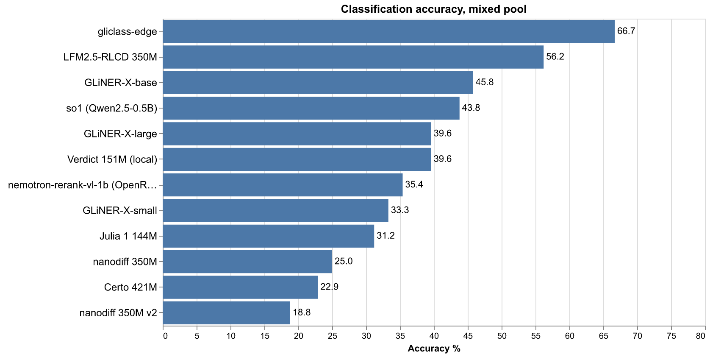
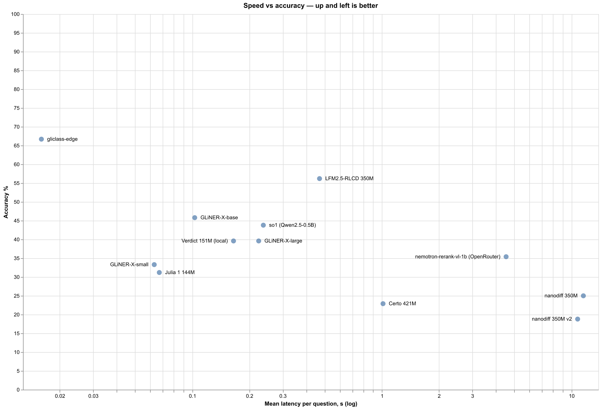
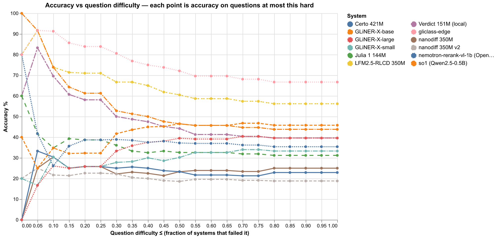
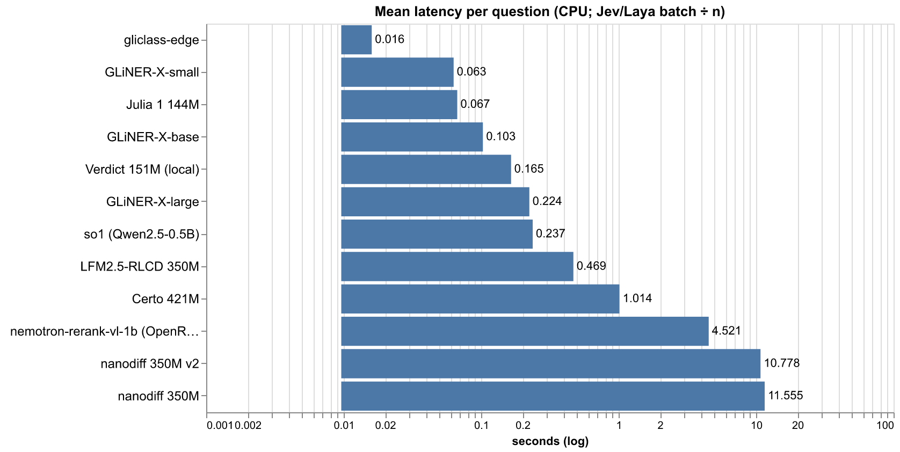
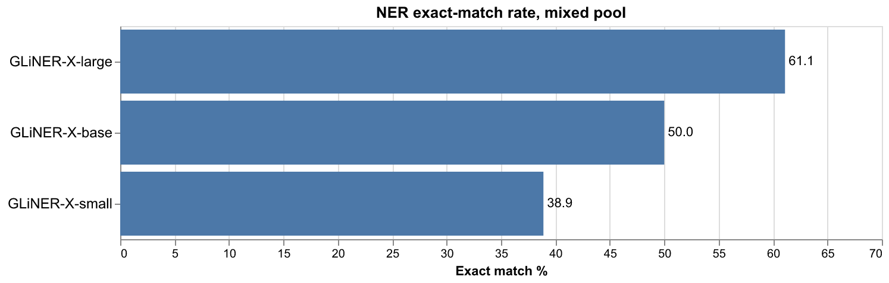
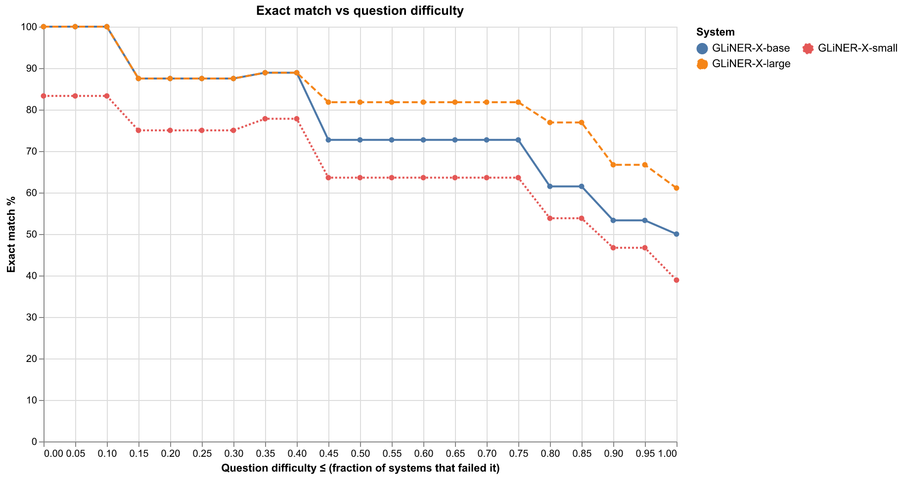
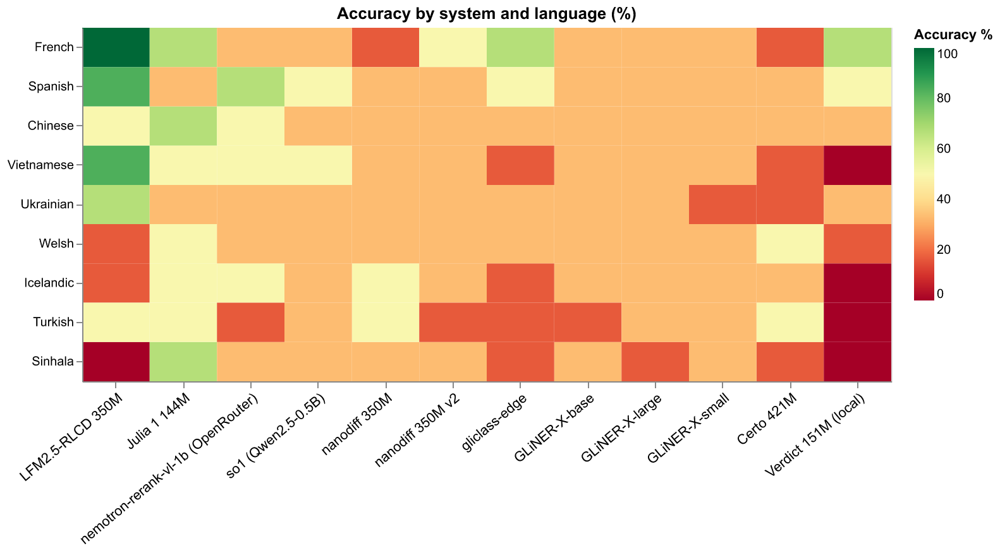
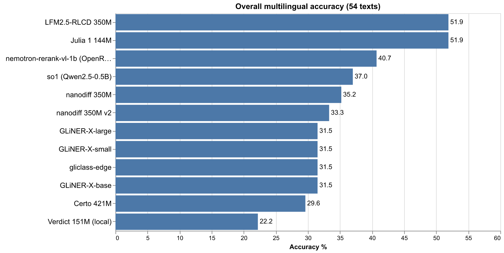

# Candidate trials

Every new system (hosted or community) is screened on a fixed
12-question mini-pool before benchmark integration: the first 12 of
`bench_spectrum.py`'s mixed classification pool, one warm-up call,
per-question timing. 12/12 graduates to the benchmark. Everyone else is
here — the good ones are in the README, the rest is this file, data
kept. Raw artifacts in `_trials/` (gitignored).

## Culled from the benchmark

LFM2.5-RLCD and the nanodiff pair failed the 12/12 trial; the other
nine sit at or below those systems' benchmark scores. Their engines and
demo tabs stay in the repo, runnable as before.

| System | What | Params | License | Trial |
|---|---|---|---|---|
| [LFM2.5-RLCD](https://huggingface.co/notnotsamuel/LFM2.5-350M-RLCD) | RLCD-trained LFM2.5, constrained decoding over a JSON schema | 350M | engine MIT; weights LFM Open License v1.0 | 10/12 |
| [nanodiff 350M](https://huggingface.co/pngwn/nanodiff-350m-typed-decisions-lam1) | bidirectional diffusion LM, option-letter softmax | 350M | MIT | 6/12 |
| [nanodiff 350M v2](https://huggingface.co/pngwn/nanodiff-350m-typed-decisions-v2) | v2 retrain of the same recipe | 350M | MIT | — (v1's recipe) |
| [Certo 421M](https://huggingface.co/altslate/certo-decision-model) | local decision model (calibrated per-option score head over ModernBERT-large, no generation) | 421M | MIT (engine + weights) | — |
| [Verdict 151M](https://huggingface.co/heman10x/rlcd-modernbert-151m) | local decision encoder (ModernBERT + abstention head) | 151M | Apache 2.0 | — |
| [Julia 1 144M](https://huggingface.co/SupersonicLabs/Julia-1) | local decision model (mmBERT-small encoder + decision head, full softmax over 2–20 described options) | 144.3M | Apache 2.0 | — |
| [GLiNER-X-small](https://huggingface.co/knowledgator/gliner-x-small) | local multilingual extractor encoder (span-level gliner over an mT5 encoder, stanza word splitter; NER-only) | 300M | Apache 2.0 | — |
| [GLiNER-X-base](https://huggingface.co/knowledgator/gliner-x-base) | same mT5 generation at the middle scale | 494M | Apache 2.0 | — |
| [GLiNER-X-large](https://huggingface.co/knowledgator/gliner-x-large) | largest of the three | 865M | Apache 2.0 | — |
| [nemotron-rerank-vl-1b](https://openrouter.ai/nvidia/llama-nemotron-rerank-vl-1b-v2:free) | cloud reranker via OpenRouter ((instruction, label) pair scoring, argmax = decision) | 1.7B | proprietary API | — |
| [so1 (Qwen2.5-0.5B)](https://github.com/ikermoel/open-alternative-jev) | local decision harness over any ChatML LLM (logprobs) | BYO LLM (tested Qwen2.5-0.5B) | Apache 2.0 | — |
| [gliclass-edge](https://github.com/knowledgator/gliclass) | local zero-shot classifier (all labels, one pass), edge size | 33M | Apache 2.0 | — |

Mixed-pool spectrum (48 cls questions):

| System | Cls | s/q | NER |
|---|---|---|---|
| gliclass-edge | 66.7% | 0.016 | n/a |
| LFM2.5-RLCD 350M | 56.2% | 0.469 | n/a (schema subset can't express spans) |
| GLiNER-X-base | 45.8% | 0.103 | 50% (0.079 s) |
| so1 (Qwen2.5-0.5B) | 43.8% | 0.237 | n/a |
| Verdict 151M | 39.6% | 0.165 | n/a |
| GLiNER-X-large | 39.6% | 0.224 | 61% (0.162 s) |
| nemotron-rerank-vl-1b | 35.4% | 4.521 | n/a |
| GLiNER-X-small | 33.3% | 0.063 | 39% (0.046 s) |
| Julia 1 144M | 31.2% | 0.067 | n/a |
| nanodiff 350M | 25.0% | 11.56 | n/a (single-letter choice interface) |
| Certo 421M | 22.9% | 1.014 | n/a |
| nanodiff 350M v2 | 18.8% | 10.778 | n/a (same as v1) |

Multilingual suite (9 languages; popular / medium / rare / overall):

| System | popular | medium | rare | overall | s/q |
|---|---|---|---|---|---|
| LFM2.5-RLCD 350M | 78% | 67% | 11% | 52% | 0.507 |
| Julia 1 144M | 56% | 44% | 56% | 52% | 0.064 |
| nemotron-rerank-vl-1b | 50% | 33% | 39% | 41% | 4.446 |
| so1 (Qwen2.5-0.5B) | 39% | 39% | 33% | 37% | 0.281 |
| nanodiff 350M | 28% | 39% | 39% | 35% | 12.223 |
| nanodiff 350M v2 | 39% | 28% | 33% | 33% | 11.689 |
| GLiNER-X-small | 33% | 28% | 33% | 31% | 0.231 |
| GLiNER-X-base | 33% | 28% | 33% | 31% | 0.106 |
| GLiNER-X-large | 33% | 33% | 28% | 31% | 0.252 |
| gliclass-edge | 50% | 22% | 22% | 31% | 0.041 |
| Certo 421M | 28% | 28% | 33% | 30% | 0.715 |
| Verdict 151M | 50% | 11% | 6% | 22% | 0.179 |

The nanodiff pair are chance-level (near-uniform option probabilities)
and the slowest runs recorded; Verdict's multilingual row and Certo's
mixed-pool row are the bottoms of their columns. Full recorded rows,
per-question predictions included, in `_trials/culled/`.

## Charts

## Never benched (trial failures)

| System | Trial result |
|---|---|
| `Quazim0t0/Byrne-Jev-79M` | 9/12 easy, 7/16 hard (hard-tier pool) |
| Dohnuts 0.8B (iACE, from-scratch) | unrunnable — its released runtime hardcodes CUDA (flash-linear-attention[rocm], `.to("cuda")`); no CPU path |
| `tasksource/modernbert-tasksource-jev` | unrunnable — its `modernjev` package is unpublished, source links 404, card says "preview, not ready to use" |
| `shreyanbr/system-one-gold` | unrunnable — requires a `systemone` engine package and calibration file that are not published |
| `idlabs/jev-typed-decisions-causal-0.6b` | gated on HF (401) |
| `anthonym21/qwen3-0.6b-rlcd-decision` (eve-rlcd's RLCD recipe on Qwen3-0.6B) | 11/12 easy at 2.2 s/q |
| `shgao/rsi-jev-v6.1-vl-4b` (RSI-Jev; `rsi-jev serve` speaks the Jev wire API so the repo's JevClient runs it) | 10/12 easy at 3.3 s/q (Decision Index 0.3 public 50.98 on its card) |
| `Manavarya09/verdict` "Verdict-MM" (verdictml, 118M multilingual e5) | 9/12 easy at 0.090 s/q (conformal abstention on the card) |
| `nandakishorm/vega-08b-public-intents` (frozen Qwen3.5-0.8B feeding a 57 MB particle-settling "physics engine"; no relation to Decision 2.0's Vega-27B) | 9/12 easy at 0.45 s/q CPU fp32; conformal abstain flagged every miss (17/17 on the non-abstained answers); the shipped adapters never gated on, no license in the repo |
